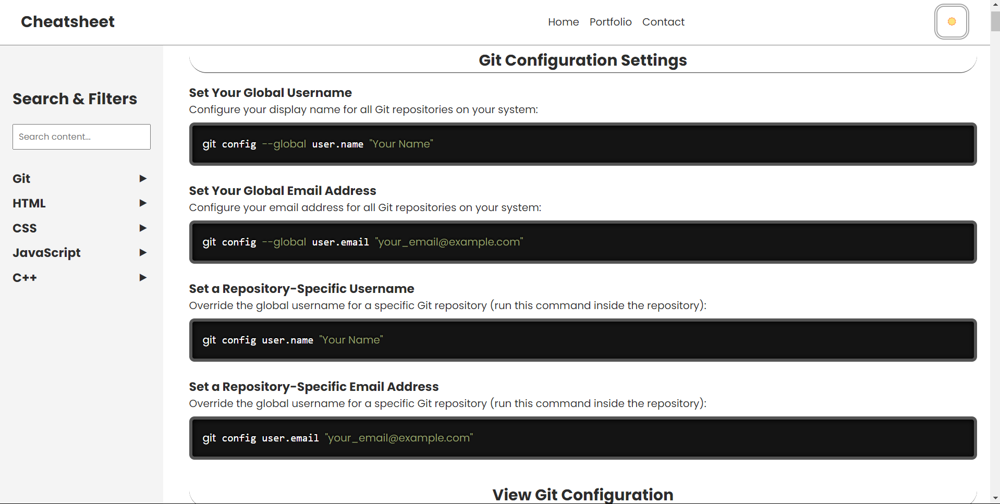

# 🧾 MyCodeSheet

A simple and clean code cheatsheet website inspired by W3Schools, designed to store and showcase essential code templates and configurations for developers.

🌐 **Live Demo**: [https://atsuchak.github.io/MyCodeSheet](https://atsuchak.github.io/MyCodeSheet)



---

## 🚀 Features

- 📚 Preloaded code snippets in various languages:
  - Git
  - HTML
  - CSS
  - JavaScript
  - C++
- 🔍 **Sidebar Navigation** — click any topic to auto-scroll to its section.
- 🧠 **Search Bar** — highlights content matching your query (searches across visible content).
- 🎨 Clean and responsive user interface.
- 🛠 No backend or installations required — just open in your browser.

---

## 🛠 Tech Stack

- **HTML**
- **CSS**
- **JavaScript**

---

## 📁 Getting Started

This is a frontend-only project. To use it:

1. **Clone the repository**
   ```bash
   git clone https://github.com/atsuchak/MyCodeSheet.git